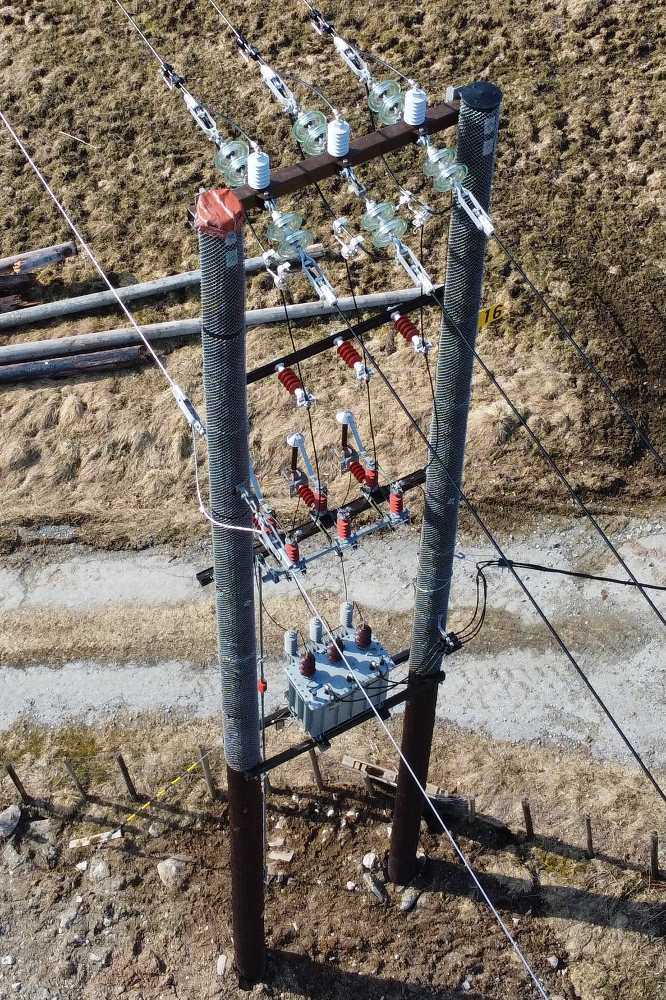

# Inspecting power systems

## **Introduction**

The ability to identify key components from drone imagery could be a extremly useful as part of another pipeline to for example detect faults or relating real world components to virtual components. For example in using a drone to map powergrids for [NVE Atlas](https://atlas.nve.no/Html5Viewer/index.html?viewer=nveatlas#).

**Task defined in the project catalog:**

> Drones enable visual inspection of power lines. Combined with computer vision and autonomous navigation, they can provide a cheap and accurate way to assess conditions and detect defects, even in remote or rugged areas. Drones equipped with high-resolution cameras can capture images of power lines from different angles, allowing fordetailed inspections of the lines for any signs of damage or wear.Equipped with thermal sensors able to see “hot spots,” their utility is further expanded, enabling the detection of loose connections or other equipment failures. The drone data can be transmitted in real-time to a remote monitoring station, allowing for real-time monitoring of the power lines and rapid response to any detected issues Goals
>* Create a system to precisely locate power lines in images collected from drones.
>* To broaden the project’s perspective, you can investigate ways to detect and classify power stations from aerial imagery.

**My Goal:**

* Detect powerlines, masts, transformers and top-covers from drone images using a convolutional neural network (CNN), combine these to an ensemble and then potentially use that in a pipeline for mapping energy infrastructure with location data to physical components.  

**Open datasets:**

1. PLD-UAV data set: [GitHub](https://github.com/SnorkerHeng/PLD-UAV). This dataset has labeled data of power line images in both urban and mountainus terrain. Limited to only images of powerlines. Not able to implement anything else than power line detection.
2. OGNet data set: [Stanford ML Group](https://stanfordmlgroup.github.io/projects/ognet/). This is a data set of oil refineries. Still, the methods and experience you’ll obtain from studying this data set will be highly generalizable to similar problems (if you get a hold of labeled data).
3. Self collected data using a DJI-mini 2 drone flown in Sogn og Fjordane, Norway. [GitHub link](https://github.com/snadderbyte/powerstations). These images were croped into a 4:3 ratio, and then labeled using label-studio.

I Will be using the third dataset for this project.

## **Problem**

<i>

Example cases:

* A region loses power due to a tree falling over the power lines. To find where the failure is the drone is flown along the lines until the failure is found. 
* Power lines are critical infrastructure and therefore require regular maintenance. A drone could be flown along the lines to find the irregularities and other artifacts, such as missing or damaged top covers, that could compromise the infrastructure.

</i>

## **Components**

### **The mast**

Masts are the either wooden or metalic structures on which the power system components are mounted. 

### **The powerlines**

The powerlines are lines across each image often in black, white or grey.

### **Transformer and Top-cover**

Some smaller tranformers are often mounted directly on the masts itself. They are metallic boxes with lots of radiator lines for cooling on the outside. 

Top-covers are mounted on top of wooden masts to keep moisture and rainwater away from the core of the wood. These are often just black plastic cicles.

The picture below show a wooden mast with a transformer and one missing top-cover. Top-cover are the black circles on top of each pole these play a critical role in safety. Without them the masts rots extremly fast, and this rot is extremly hard to detect, because the mast will remain stading even though its rot has hollowed out the core of the mast. Transformers are the metal boxes attached half-way up the mast. 

## **Data**

The dataset that will be used for this project is made up of images taken in the forests of Northern Vestland, Norway. They were all taken in late march 2023.

<i>

Upps: 
* New images
* Good spread of infrastructue size
* High quality images

Downs:
* Small dataset size
* Low count of transformers and top-covers
* Large images, power lines can be quite small(pixelsize)

</i>

Both images and mask are saved as image data. The image under show mask overlayed on the original image.

## **Models**

The initial approach uses a convolutional neural network. (CNN) Through the fastai API. With the a vision_learner and using a pretrained resnet neural network.

## **Conclusion**

These models are only a proof of concept and overall could not be used in a production system. Top-cover and transformer models are not able to accurately mark their targets.

The mast model is the best performer overall. Allthough it is most accurate on wooden masts. Mostlikely 
## **Discussion**

Throughout the project I made several mistakes. In no praticular order:
* Labeling data took longer than i expected.
* Sloppy labeling
* Not using all the tools avaliable. (openCV and such)
* Other time manageing issues

Something i especially regret is not using contour analysis for creating masks.

I would only 
